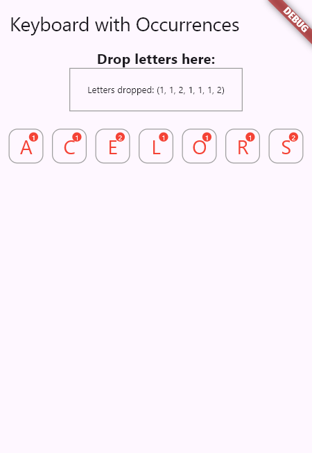

# Keyboard Occurrences

This project demonstrates a Flutter application that allows users to interact with a virtual keyboard to manage occurrences of letters.

<p align="center">
  
</p>

## Table of Contents

- [Description](#description)
- [Installation](#installation)
- [Usage](#usage)
- [Contributing](#contributing)
- [License](#license)

## Description

The Keyboard Occurrences application is built using Flutter and Dart. It provides a graphical interface where users can drop letters onto a designated area and manage their occurrences dynamically. The application supports drag-and-drop functionality to simulate letter dropping and updates occurrences in real-time.

## Installation

To run the application locally, follow these steps:

1. **Prerequisites:**
   - Ensure you have Flutter installed. For installation instructions, refer to the [Flutter Documentation](https://flutter.dev/docs/get-started/install).

2. **Clone the Repository:**

   ```bash
   git clone https://github.com/flaviens31/keyboard_occurrences.git
   cd keyboard_occurrences
   ```

## Usage

1. **Run the Application:**
   - Open the project in your preferred Flutter IDE or editor.

2. **Build and Run:**
   - Ensure your device or emulator is connected and recognized by Flutter.
   - Run the application using the command:

     ```bash
     flutter run
     ```

   - This command will compile the Flutter code and deploy the application to your device or emulator.

3. **Interact with the Application:**
   - The application displays a screen with draggable letters and a drop area.
   - Drag the letters onto the drop area to decrement their occurrence count.
   - The occurrence count updates visually on each letter.
   - Experiment with different interactions to explore the functionality.

4. **Explore the Code:**
   - Review the Dart code in your IDE to understand how the draggable letters and occurrence counts are managed.
   - Modify the code to experiment with different features or behaviors.

5. **Troubleshooting:**
   - If you encounter any issues during setup or execution, refer to the [Flutter Documentation](https://flutter.dev/docs) or community resources for assistance.

## Contributing

Contributions are welcome! Here's how you can contribute to the development of this Flutter application:

1. **Fork the Repository:**
   - Fork the repository to your own GitHub account.

2. **Clone the Repository:**
   - Clone the forked repository to your local machine using Git.

     ```bash
     git clone https://github.com/your-username/keyboard_occurrences.git
     ```

3. **Create a Branch:**
   - Create a new branch to work on your feature or bug fix.

     ```bash
     git checkout -b feature/your-feature-name
     ```

4. **Make Changes:**
   - Make your desired changes to the codebase.

5. **Test Your Changes:**
   - Test your changes thoroughly to ensure they work as expected.

6. **Commit Changes:**
   - Commit your changes with descriptive commit messages.

     ```bash
     git commit -am 'Add new feature: description of your changes'
     ```

7. **Push Changes:**
   - Push your changes to your forked repository.

     ```bash
     git push origin feature/your-feature-name
     ```

8. **Create a Pull Request:**
   - Go to the GitHub repository and navigate to the branch you just pushed from.
   - Click on the "Compare & pull request" button to create a new pull request.
   - Provide a detailed description of your changes and submit the pull request.

9. **Discuss and Review:**
   - Participate in the code review process by responding to feedback or suggestions for improvements.
   - Make necessary changes to your pull request if requested.

10. **Merge Pull Request:**
    - Once approved, your pull request will be merged into the main repository branch.

11. **Thank You!**
    - Thank you for contributing to the project! Your efforts help improve the application for everyone.

## License

This project is licensed under the Apache License 2.0 - see the [LICENSE](./LICENSE) file for details.
